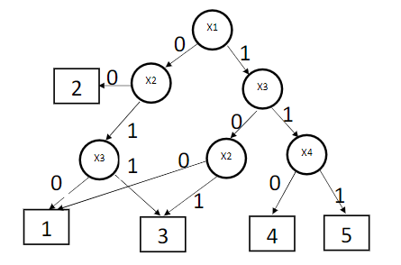

# Задача 3. Принятие решения по бинарному деревурешений

Задано дерево принятия решений. Вершины дерева соответствуют бинарным переменным. Конечные вершины – номеру принятого решения. Пример дерева:

Для принятия решения у пользователя запрашивается набор значений переменных `Х1Х2Х3Х4`.
Например, это может быть 1001. Какое решение соответствует этому набору в дереве, легко определить, выполнив переходы от вершины к вершине.
Для заданных выше значений решение равно значению 1.

**Необходимо** разработать программу, которая `читает из файла` и `строит в памяти дерево` принятия решений
и для заданных значений переменных (с консоли) `находит номер решения` и `выводит его на консоль`.
